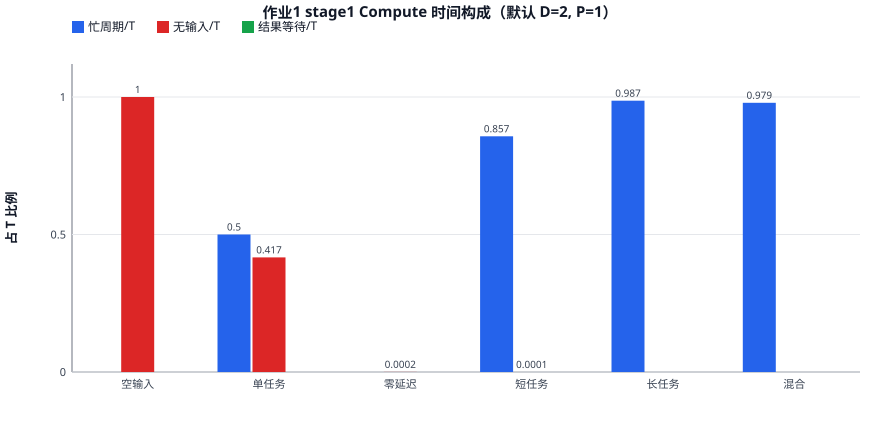
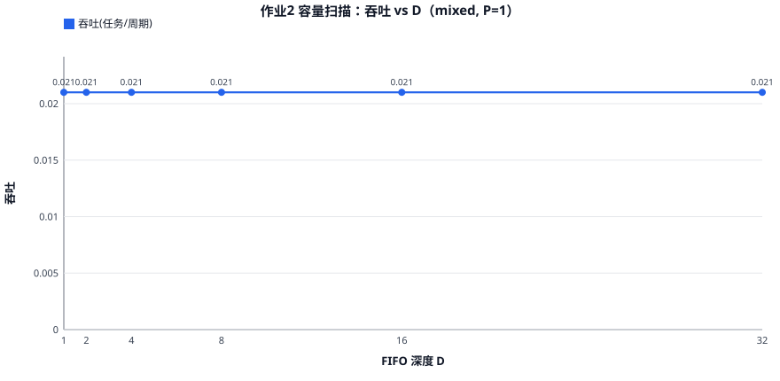
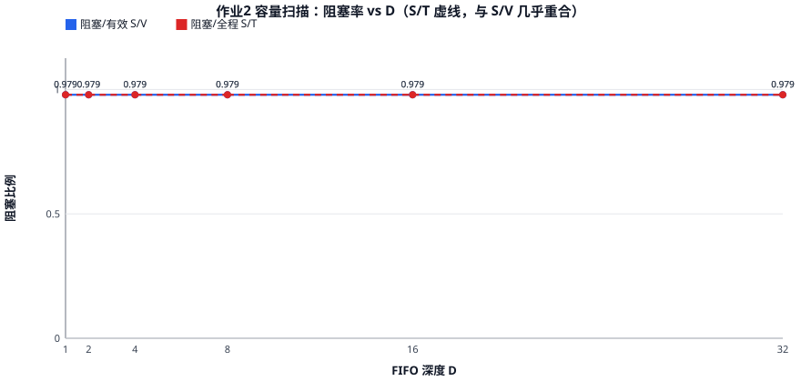
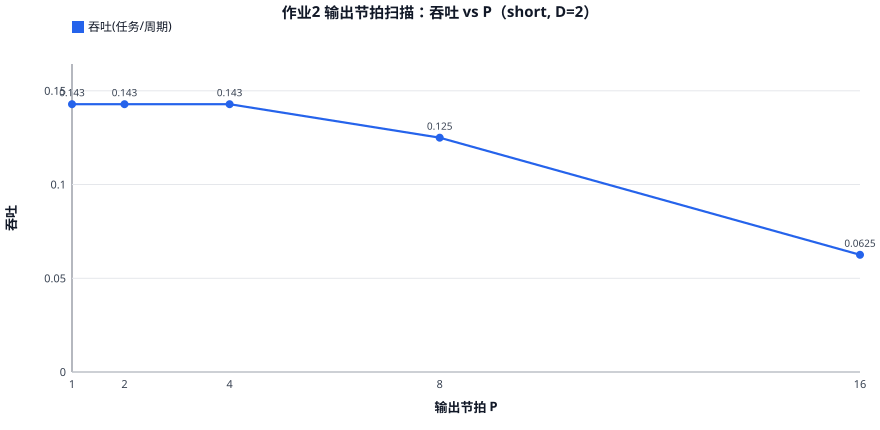
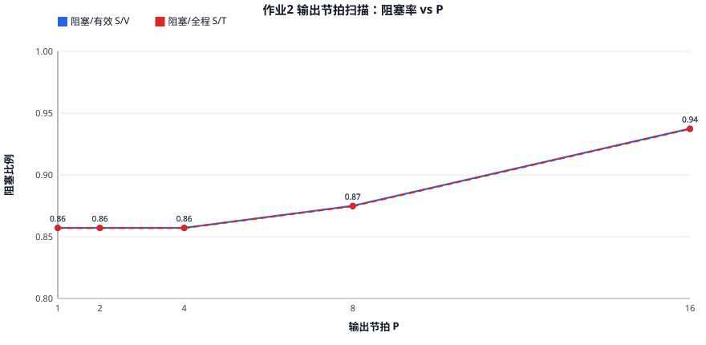
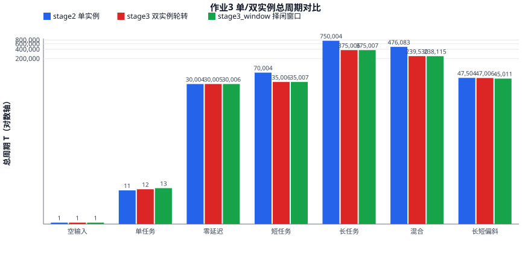
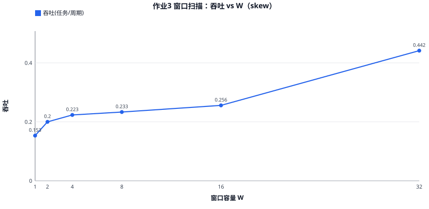
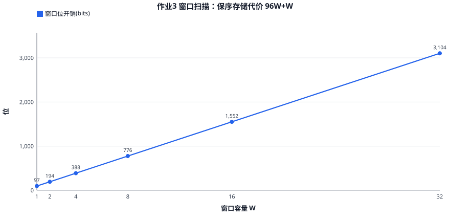
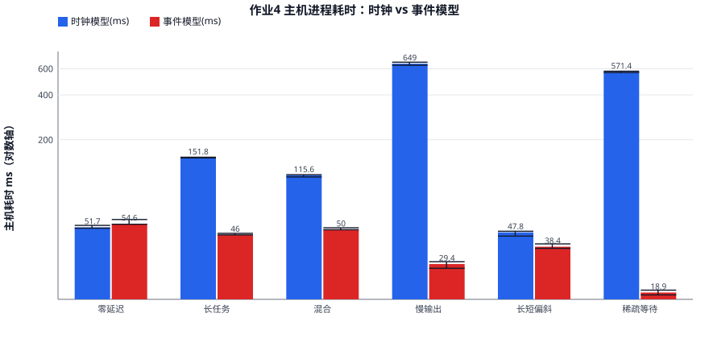

# 作业 1～4 指标实测结果

2026-09-10 晚；基线 `9dd3b1a`，测量脚本与证据为本条所在提交。按 [指标与呈现方案](metrics-presentation.md) 的最小实验矩阵实际跑数，报告分为四阶段总览与对照表；场景、公式和未覆盖项沿用该设计文档。

**结论速览：作业 1 各场景满足 `T = B + N + 5` 的周期契约；作业 2 显示 FIFO 容量不改变饱和吞吐、输出节拍 `P > 7` 后吞吐降为 `1/P`；作业 3 计算受限负载双实例加速比≈2.0、长短偏斜负载受队头保序限制仅 1.06×，窗口扩到 32 后恢复 2.0×；作业 4 两模型功能与时序完全等价，事件模型主机耗时在慢输出/稀疏等待场景快 22×/30×（进程口径），详细 Trace 使事件模型变慢的 B-011 在 Linux 复现。**

## 0. 方法与环境

- 构建：WSL2 Ubuntu 22.04、g++ 11.4、SystemC 3.0.1（third_party 源码）、`CMake_BUILD_TYPE=Release`，Linux 原生构建 `build-linux/`；测量前 CTest 25/25 通过。二进制与源码哈希见 [environment.json](evidence/metrics-matrix/environment.json)。
- 默认参数：`DEPTH=2, RESULT_DEPTH=2, WINDOW=8, SEED=7, OUTPUT_PERIOD=1`；`MAX_CYCLES` 统一传 10⁹。场景输入由固定种子生成（混合负载种子 20260910，与既有 Windows 基线一致）：空输入、单任务、零延迟（(7,0)×30000）、短任务（(48,18)×10000，L=6）、长任务（斐波那契对×10000，L=74）、混合（随机×10000）、长短偏斜（[1 长+20 零延迟]×500=10500）、慢输出（短任务×2000，P=1000）、稀疏等待（1 任务，P=2×10⁶）。
- 正确性：每次运行都用独立 `math.gcd` 校验输出值与顺序；另有两项一致性检查通过——同一配置 Trace 开/关的统计 CSV 逐字节一致（EventRecorder 被动观察者契约的实测验证）、重复运行统计哈希一致（确定性）。
- 主机测量：进程口径（含启动），每配置预热 1 次＋正式 7 次，两模型逐轮交替顺序；墙钟用 `perf_counter`，CPU 时间与峰值 RSS 取自 `wait4`。Windows 基线的模型入口口径（排除启动）数据保留在 [双模型实测](model-comparison.md)，两者口径不同不可直接比较，见 §4。
- 证据文件（`run_id` 关联）：[runs.csv](evidence/metrics-matrix/runs.csv)（每运行一行）、[resources.csv](evidence/metrics-matrix/resources.csv)（每资源一行）、[profiling_samples.csv](evidence/metrics-matrix/profiling_samples.csv)（每次主机测量一行）、各阶段汇总表与 SVG 图同目录；输入与大 Trace 在被忽略的 `tmp/metrics-matrix/`，可由脚本重建。

## 1. 作业 1：完成多少、花多久、资源用了多少

### 1.1 性能总览（stage1，D=2，P=1）

| 场景 | N | T | 吞吐 N/T | 忙周期 B | 利用率 B/T | 无输入/T | 结果等待/T | e2e 均值 | e2e P95 | e2e 最大 |
|---|---:|---:|---:|---:|---:|---:|---:|---:|---:|---:|
| 空输入 | 0 | 1 | 0 | 0 | 0% | 100% | 0% | — | — | — |
| 单任务 | 1 | 12 | 0.0833 | 6 | 50.0% | 41.7% | 0% | 11 | 11 | 11 |
| 零延迟 | 30000 | 30005 | 0.9998 | 0 | 0% | 0.02% | 0% | 5 | 5 | 5 |
| 短任务 | 10000 | 70005 | 0.1429 | 60000 | 85.7% | 0.01% | 0% | 47.0 | 47 | 47 |
| 长任务 | 10000 | 750005 | 0.01333 | 740000 | 98.7% | 0.00% | 0% | 522.8 | 523 | 523 |
| 混合 | 10000 | 476084 | 0.02100 | 466079 | 97.9% | 0.00% | 0% | 331.2 | 348 | 368 |

周期契约验证：五个非空场景全部满足 **`T = B + N + 5`**（如混合 466079+10000+5=476084）。每任务服务占 `L+1` 拍（L 为取余延迟），常数 5 为启动与排空；这从数据侧印证了 Compute「完成沿不收新任务、下拍才可再接收」的时序约定。零延迟场景忙周期为 0 但吞吐 0.9998——按模型假设 `b=0` 无取余工作，不代表系统未处理任务（[设计文档](metrics-presentation.md) §2 预判的情形）。混合负载 e2e 均值 331.2 拍中计算仅 46.6 拍，其余为排队（precompute 段均值 283.6 拍）。

### 1.2 缓冲资源（stage1，容量 D=2）

| 资源 | 短任务 均值/峰值占用（率） | 长任务 | 混合 |
|---|---|---|---|
| Parser→Transform FIFO | 1.86/2（92.8%/100%） | 1.99/2（99.3%/100%） | 1.98/2（98.9%/100%） |
| Transform→Compute FIFO | 1.86/2（92.8%/100%） | 1.99/2（99.3%/100%） | 1.98/2（98.9%/100%） |
| Compute→Output FIFO | 0.14/1（7.1%/50%） | 0.01/1（0.7%/50%） | 0.02/1（1.1%/50%） |
| Transform 流水寄存器（K=2） | 2.00/2（100.0%） | 2.00/2（100.0%） | 2.00/2（100.0%） |

计算受限时上游缓冲满、下游近空：任务在 Parser→Transform 处排队，Compute 一空就被取走。全部资源逐场景数据见 [resources.csv](evidence/metrics-matrix/resources.csv)。



## 2. 作业 2：阻塞发生在哪、持续多久、是否影响整体性能

### 2.1 接口变化（stage1 FIFO 链 → stage2 valid/ready 链）

同输入同参数下，stage2 与 stage1 相比：混合负载 T 476084→476083（省 1 拍，少一级 FIFO 传输），e2e 均值 331.2→237.0（precompute 段 283.6→189.4，链路保持语义减少一拍传输）；短任务 e2e P95 47→34。吞吐不变——接口改变的是延迟与阻塞可观测性，不是服务速率。

### 2.2 FIFO 容量扫描（stage2，混合负载，P=1）

| D | T | 吞吐 | 阻塞 S | S/V | S/T | 结果等待 | e2e P95 | 阻塞段数 | 段均长 | 最长段 |
|---:|---:|---:|---:|---:|---:|---:|---:|---:|---:|---:|
| 1 | 476083 | 0.02100 | 466034 | 97.90% | 97.89% | 0 | 202 | 9999 | 46.6 | 59 |
| 2 | 476083 | 0.02100 | 466035 | 97.90% | 97.89% | 0 | 251 | 9999 | 46.6 | 59 |
| 4 | 476083 | 0.02100 | 466035 | 97.90% | 97.89% | 0 | 349 | 9999 | 46.6 | 59 |
| 8 | 476083 | 0.02100 | 466035 | 97.90% | 97.89% | 0 | 545 | 9999 | 46.6 | 59 |
| 16 | 476083 | 0.02100 | 466035 | 97.90% | 97.89% | 0 | 933 | 9999 | 46.6 | 59 |
| 32 | 476083 | 0.02100 | 466035 | 97.90% | 97.89% | 0 | 1705 | 9999 | 46.6 | 59 |

- **容量不改吞吐**：瓶颈是 Compute 每任务 `L+1` 拍的接受率，FIFO 只是排队空间。阻塞段 9999 段、均长 46.6≈每任务平均 L，最长 59=最长任务的 L——阻塞以任务为粒度周期出现，正对应「每个任务被扣在链路上直到 Compute 空闲」。
- **更深的 FIFO 换来更长延迟**：e2e P95 从 202（D=1）涨到 1705（D=32）——任务更早进入系统、在更长的队列里等。同时 Parser→Transform 平均占用率 97.9%→99.8%（始终近满），Compute→Output 稳定约 2.1%。
- 连续阻塞段为原设计的「新增」项，本次通过逐周期 `link` 事件 Trace 离线导出完成（离线总阻塞拍数与模型 `handshake_blocked_cycles` 逐配置核对一致）。




### 2.3 输出节拍扫描（stage2，短任务 L=6，D=2）

| P | T | 吞吐 | S/V | S/T | 结果等待周期 | e2e P95 | 段均长/最长 |
|---:|---:|---:|---:|---:|---:|---:|---:|
| 1 | 70004 | 0.14285 | 85.71% | 85.70% | 0 | 34 | 6.0/6 |
| 2 | 70004 | 0.14285 | 85.71% | 85.70% | 0 | 35 | 6.0/6 |
| 4 | 70004 | 0.14285 | 85.71% | 85.70% | 0 | 37 | 6.0/6 |
| 8 | 80008 | 0.12499 | 87.50% | 87.47% | 9990 | 53 | 7.0/7 |
| 16 | 160000 | 0.06250 | 93.75% | 93.72% | 89966 | 109 | 15.0/15 |

吞吐精确等于 **`1/max(7, P)`**：P≤4 时计算是瓶颈（每任务 7 拍），P=8 起输出成为共同瓶颈（结果等待出现），P=16 时完全输出受限（T=16×10000）。慢输出极端情形（P=1000）：T=2×10⁶、S/V=99.9%、计算利用率 0.6%、结果等待占总周期 99.2%，e2e 均值 6986 拍。




### 2.4 背压传播时间线（短任务×24，P=8，D=2，含周期号）

| id | send | transform 出 | compute 收 | 完成 | 结果写出 | output | 结果等待 |
|---:|---:|---:|---:|---:|---:|---:|---:|
| 0 | 1 | 4 | 4 | 10 | 10 | 16 | 0 |
| 1 | 2 | 11 | 11 | 17 | 17 | 24 | 0 |
| 2 | 3 | 18 | 18 | 24 | 24 | 32 | 0 |
| 5 | 12 | 39 | 39 | 45 | 45 | 56 | 0 |
| 10 | 47 | 74 | 74 | 80 | 81 | 96 | 1 |
| 11 | 54 | 82 | 82 | 88 | 89 | 104 | 1 |

（完整 24 行见 [timeline_slow_sink.csv](evidence/metrics-matrix/timeline_slow_sink.csv)。）

读法：Output 每 8 拍才读一个结果（16, 24, 32, …）。Compute→Output FIFO（容量 2）加上 Compute 的 RESULT_PENDING 状态先吸收前几个结果；从第 10 个任务起 Compute 完成后写不出去（结果等待=1）→ transform 在 valid/ready 链上被扣（send 与上任务间隔从 1 拍拉大到 7~8 拍）→ Parser→Transform FIFO 塞满后 Parser 减速到输出速率。这就是「输出变慢→结果滞留→上游握手受阻→源头限速」的背压传播链，各环节都能在时间线中找到对应周期号。

## 3. 作业 3：并行收益与保序代价

### 3.1 单实例（stage2） vs 双实例（stage3 轮转 / stage3_window 择闲+窗口 W=8）

| 场景 | T 单 | T 双轮转 | T 择闲窗口 | 加速比(轮转) | 加速比(窗口) | 并行效率(窗口) | U0 | U1 | N0/N1 | 忙不均衡 |
|---|---:|---:|---:|---:|---:|---:|---:|---:|---:|---:|
| 空输入 | 1 | 1 | 1 | 1.00 | 1.00 | — | 0% | 0% | 0/0 | — |
| 单任务 | 11 | 12 | 13 | 0.92 | 0.85 | 0.42 | 0% | 46.2% | 0/1 | 100% |
| 零延迟 | 30004 | 30005 | 30006 | 1.00 | 1.00 | 0.50 | 0% | 0% | 15158/14842 | — |
| 短任务 | 70004 | 35006 | 35007 | 2.00 | 2.00 | 1.00 | 85.7% | 85.7% | 5000/5000 | 0% |
| 长计算 | 750004 | 375006 | 375007 | 2.00 | 2.00 | 1.00 | 98.7% | 98.7% | 5000/5000 | 0% |
| 混合 | 476083 | 239530 | 238115 | 1.99 | 2.00 | 1.00 | 97.9% | 97.9% | 5002/4998 | 0.003% |
| 长短偏斜 | 47504 | 47006 | 45011 | 1.01 | 1.06 | 0.53 | 42.3% | 40.0% | 5239/5261 | 2.8% |

- **计算受限负载接近线性加速**（短/长/混合：2.00×、2.00×、2.00×，并行效率≈1.0）；混合负载下择闲+窗口比固定轮转少 1415 拍（238115 vs 239530）。
- **无计算工作则无并行收益**：零延迟负载加速比 1.00（忙周期本来就为 0，瓶颈在传输）；单任务反而付出双实例开销（0.85×）。
- **长短偏斜暴露保序代价**：加速比仅 1.06×。负载本身不算不均衡（忙不均衡 2.8%、任务数 5239/5261），损失来自队头保序等待——见 3.3 时间线。



### 3.2 窗口容量扫描（stage3_window，长短偏斜负载）

| W | T | 吞吐 | 保序等待（/T） | 窗口信用阻塞 | 其中算力可用 | 预留均值/峰值 | 结果均值/峰值 | 窗口位开销 |
|---:|---:|---:|---:|---:|---:|---:|---:|---:|
| 1 | 68504 | 0.1533 | 0（0%） | 57998 | 57998 | 0.85/1 | 0.15/1 | 97 |
| 2 | 52506 | 0.2000 | 36001（68.6%） | 42000 | 42000 | 1.80/2 | 0.90/2 | 194 |
| 4 | 47007 | 0.2234 | 36500（77.6%） | 36500 | 36500 | 3.78/4 | 2.77/4 | 388 |
| 8 | 45011 | 0.2333 | 34504（76.7%） | 34500 | 34500 | 7.76/8 | 6.71/8 | 776 |
| 16 | 41019 | 0.2560 | 30512（74.4%） | 30500 | 30500 | 15.74/16 | 14.58/16 | 1552 |
| 32 | 23777 | 0.4416 | 13270（55.8%） | 0 | 0 | 22.42/23 | 20.42/21 | 3104 |

- **W=1 比单实例还慢 44%**（68504 vs 47504）：信用只有 1 时，长任务占着信用，后续任务全部无法派发（57998 拍窗口阻塞且全部「算力可用」），退化为串行还多了调度开销。
- **W=8（默认）吞掉了大部分并行收益**：块内 21 个任务只能 8 个在途，加速比 1.06×。
- **W=32 ≥ 块长 21+2 后窗口阻塞消失**，加速比回到 2.0×（23777≈47504/2）；此时预留峰值 23、结果峰值 21，窗口不再是瓶颈。保序等待占 T 的比例在 W=2~16 稳定在 68%~78%，W=32 降至 55.8%。
- 保序存储代价 = 结果载荷 96W bit + 有效位 W bit（W=32 时 3104 bit，系统总 buffer_payload_bits 4160 bit 同见 [a3_window.csv](evidence/metrics-matrix/a3_window.csv)）。
- 结果 FIFO 深度扫描（R=1/2/4/8，混合负载）对 T、利用率、结果等待均无影响：Collector 持续排空，结果 FIFO 从不成为瓶颈（[a3_result_depth.csv](evidence/metrics-matrix/a3_result_depth.csv)）。




### 3.3 乱序完成、按序输出时间线（skew 前两块，W=8，含周期号）

| id | 引擎 | 收 | 完成 | 入窗 | 按序退休 | 窗内驻留 |
|---:|---:|---:|---:|---:|---:|---:|
| 0（长） | 1 | 4 | 78 | 79 | 80 | 1 |
| 1 | 0 | 5 | 5 | 6 | 81 | 75 |
| 2 | 0 | 6 | 6 | 7 | 82 | 75 |
| … | … | … | … | … | … | … |
| 7 | 0 | 11 | 11 | 12 | 87 | 75 |
| 8 | 1 | 81 | 81 | 82 | 88 | 6 |
| … | … | … | … | … | … | … |
| 20 | 1 | 93 | 93 | 94 | 100 | 6 |
| 21（长） | 1 | 94 | 168 | 169 | 170 | 1 |

（完整表见 [timeline_skew.csv](evidence/metrics-matrix/timeline_skew.csv)。）

读法：长任务 0 在引擎 1 上跑到第 78 拍；短任务 1~7 当拍就算完（第 5~11 拍）进了窗口，但必须等 0 退休（80 拍）才能按序输出——窗内驻留 75 拍，这就是 reorder_wait 的来源。同时 W=8 的信用被 0~7 占满，任务 8 直到 81 拍（0 退休返还信用）才被派发——信用阻塞与队头等待叠加，正是 3.2 表中「窗口阻塞且算力可用」的微观机制。下一块的长任务 21 又在 94 拍重复同样的模式。

## 4. 作业 4：两种仿真模型

### 4.1 功能与时序等价（stage3_window 时钟模型 vs stage4 事件模型）

| 场景 | 任务数 | 周期 时钟/事件 | 输出一致 | 全部统计一致 |
|---|---:|---|---|---|
| 空输入～稀疏等待共 9 场景 | 0~30000 | 全部相等（如混合 238115/238115，慢输出 2×10⁶/2×10⁶） | ✔ | ✔ |
| 短任务/混合小样本＋Trace | 2000/1000 | — | ✔ | ✔（Trace 逐字节一致） |

每个场景两模型的输出文件、完整统计 CSV 哈希一致；两组 Trace 开启场景的事件 CSV 逐字节一致（[a4_equivalence.csv](evidence/metrics-matrix/a4_equivalence.csv)）。仿真变快没有改变被模拟硬件的任何时序。

### 4.2 仿真执行效率（Linux/WSL，进程口径，中位数 [Q1–Q3]，n=7）

| 场景 | 时钟模型 ms | 事件模型 ms | 加速比 | 任务/主机秒 时钟→事件 | 事件批次数 |
|---|---|---|---:|---|---:|
| 连续零延迟 | 51.7 [51.0–53.3] | 54.6 [54.2–58.4] | 0.95× | 58.0万→55.0万 | 30006 |
| 长计算 | 151.8 [151.3–152.8] | 46.1 [46.0–47.1] | 3.30× | 6.6万→21.7万 | 25006 |
| 随机混合 | 115.6 [112.7–116.6] | 50.0 [49.9–51.4] | 2.31× | 8.7万→20.0万 | 38700 |
| 慢输出 | 649.0 [632.8–663.4] | 29.4 [27.5–30.4] | 22.11× | 3082→6.8万 | 11980 |
| 长短偏斜 | 47.8 [45.2–48.7] | 38.4 [37.4–40.0] | 1.25× | 22.0万→27.4万 | 12511 |
| 稀疏长等待 | 571.4 [565.5–577.1] | 18.9 [18.2–19.6] | 30.25× | 2→53 | 8 |

模式与 Windows 基线一致（对应 0.96×/5.78×/2.85×/71.08×/1.38×/328.82×，入口口径）：可跳过周期越多加速越明显；连续零延迟略有退化。绝对数值不可直接比较——本表为进程口径（含约 15~19 ms 进程启动），稀疏等待场景事件模型纯仿真仅约 2 ms，启动开销占比大，因此 30× 远低于 Windows 入口径的 329×；这是口径差异，不是回归。



### 4.3 仿真开销

| 场景 | CPU ms 时钟→事件 | 峰值 RSS MiB 时钟→事件 |
|---|---|---|
| 连续零延迟 | 34.9→36.8 | 23.3→23.3 |
| 长计算 | 134.0→28.6 | 23.3→23.3 |
| 随机混合 | 95.2→33.3 | 23.3→23.3 |
| 慢输出 | 633.2→11.3 | 23.3→23.3 |
| 稀疏长等待 | 555.8→3.7 | 23.3→23.3 |

Trace 开关对照（同输入同模型）：

| 输入 | 模型 | off→on ms | 耗时增幅 | off→on RSS | Trace 大小 |
|---|---|---|---|---|---|
| 短任务×2000 | 时钟 | 19.87→56.43 | +184% | 23.3→23.3 | 0.70 MiB |
| 短任务×2000 | 事件 | 20.74→60.85 | +193% | 23.3→23.3 | 0.70 MiB |
| 混合×1000 | 时钟 | 27.48→114.73 | +317% | 23.3→24.5 | 1.95 MiB |
| 混合×1000 | 事件 | 21.40→124.30 | +481% | 23.3→24.5 | 1.95 MiB |

- **B-011 在 Linux 复现**：混合小样本关 Trace 时事件模型比时钟快 1.29×（21.4 vs 27.5 ms），开 Trace 后反转为慢 8%（124.3 vs 114.7 ms），增幅 481% 对 317%——事件模型对跳过区间补齐逐周期控制行的实现（[B-011](defects.md)）是平台无关的设计问题。
- 两模型基线峰值 RSS 相同（23.3 MiB，Linux glibc+SystemC 静态库足迹；Windows MinGW 基线约 5.5~7.2 MiB），仅混合任务开 Trace 时各增约 1.2 MiB。Linux 进程足迹大于模型数据本身，不能当硬件缓冲大小。
- delta 轮次：Linux 无 `psapi` 包装入口，本表未测；沿用 [Windows 基线](model-comparison.md)（长计算 1,500,027→100,027 等），模型代码未变，该数据仍有效。

## 5. 与设计文档的差距（未覆盖项）

- 缓冲满载占比（`Σ1[q=K]/T`）与窗口驻留时长的任务级分布（均值/P95/最大）仍属「新增」观测，本轮未实现计数器；§3.3 时间线提供了驻留的样本证据（75/6 拍两类）。
- 主机耗时 P95/置信区间：7 个样本不支持，按设计沿用中位数＋四分位区间。
- 乱序输出对照实验（量化强制保序代价）按设计未实施，不作为验收项。

## 6. 复现

```bash
cmake -S . -B build-linux -DCMAKE_BUILD_TYPE=Release -DCMAKE_CXX_COMPILER=g++
cmake --build build-linux -j12          # 25/25 ctest 通过后测量
python3 scripts/run_metrics_matrix.py   # 约 4 分钟，写入 docs/evidence/metrics-matrix/
```

场景种子、参数与全部原始数据见 §0 证据文件；图表为零依赖 SVG（`scripts/metrics_svg.py`），可直接在浏览器或 VS Code 预览中打开。
