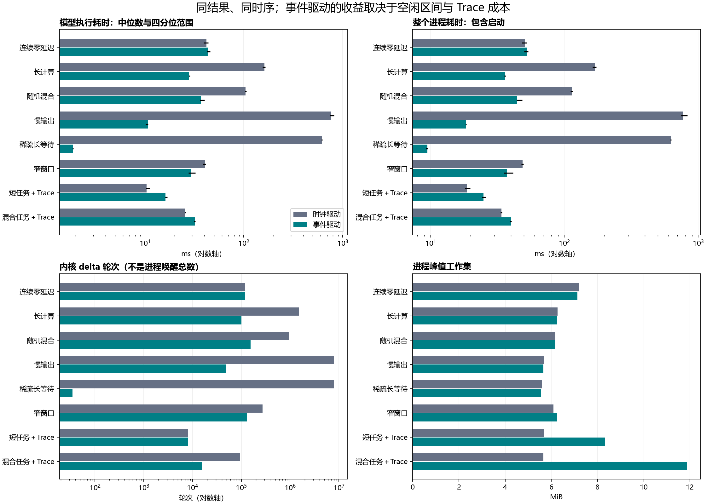

# 时钟驱动与事件驱动模型实测对比

2026-09-10；正式模型基线 `cd03b91`，测量入口与脚本为本条所在提交。对比 `stage3_window_gcd` 与 `stage4_gcd`。

**结论：功能和硬件时序保持一致；事件模型在长计算、背压和稀疏事件场景显著降低仿真成本，但连续短任务不保证提速，详细 Trace 可使它更慢、占用更多内存。**



## 方法与可信范围

- i5-12400F、12 逻辑处理器、Windows 11（26200）；MinGW GCC 13.2.0、C++17、SystemC 3.0.1，同一 Release 构建。线程/电源/CPU 频率未强制锁定，允许系统背景活动；结论限本机和这些输入。
- 每个配置每个模型预热 1 次，正式测量 7 次；串行运行，两模型先后顺序逐轮交替。主实验 8 配置，随后补测 2 个 Trace 关闭的同输入控制配置，共 140 次正式测量。每配置另运行正式二进制与包装入口核对等价。
- 默认 FIFO/结果 FIFO 均为 2，窗口 8（窄窗口为 1），仲裁种子 7；随机输入种子 20260910。慢输出周期为 1000，稀疏等待周期为 2,000,000，其余为 1；1 模拟周期=1 ns。
- 独立包装入口不修改生产源码。稳态计时从模型入口开始到返回，包含构造、仿真、统计与文件 I/O；不宣称为纯 sc_start 时间。进程耗时另含启动/退出，采用 Python 单调计时器。
- CPU 为进程用户态＋内核态累计时间；本批数据以 15.625 ms 步进，零值不代表没有 CPU 开销。工作集是进程峰值驻留内存，commit 是峰值私有提交内存；均包含运行库、模型和日志，不能当硬件缓冲大小。
- 表中耗时为中位数；方括号为 Q1–Q3。7 个样本不支持稳定的耗时 P95/置信区间；硬件任务延迟 P95 则来自模型任务统计。未清空文件缓存，Trace 控制组为主实验后的补测，不能把差异精确归因到某一条代码。

## 功能结果与系统时间

10 个配置均用独立 `math.gcd` 校验结果与顺序；每次运行的结果、全部正式统计哈希保持一致。Trace 开启的两组共 3,000 项任务，事件 CSV 也逐字节一致；关闭 Trace 的组比较输出和全部汇总统计。包装入口与正式二进制相同。另运行现有 Release CTest，15/15 通过。

下表每一项时钟模型与事件模型均相等。因此仿真变快没有改变被模拟硬件的吞吐、延迟或利用率。

| 场景 | 任务数 | 周期/ns | 吞吐（任务/周期） | Compute 利用率 | 端到端 P95（周期） | 握手阻塞占比 |
|---|---:|---:|---:|---:|---:|---:|
| 连续零延迟 | 30,000 | 30,006 | 0.9998 | 0.00% | 6 | 0.00% |
| 长计算 | 10,000 | 375,007 | 0.0266662 | 98.66% | 226 | 97.33% |
| 随机混合 | 10,000 | 238,115 | 0.0419965 | 97.87% | 154 | 95.80% |
| 慢输出 | 2,000 | 2,000,000 | 0.001 | 0.30% | 13,997 | 99.90% |
| 稀疏长等待 | 1 | 2,000,000 | 5e-07 | 0.00% | 1,999,999 | 0.00% |
| 窄窗口 | 10,500 | 68,504 | 0.153276 | 27.01% | 88 | 84.67% |
| 短任务＋Trace | 2,000 | 2,006 | 0.997009 | 0.00% | 6 | 0.00% |
| 混合任务＋Trace | 1,000 | 23,827 | 0.0419692 | 97.77% | 155 | 95.79% |

零延迟场景采用既有 b=0 的 Model Assumption，因此 Compute 忙周期为零；它用于暴露事件密集时的调度成本。窗口 8/1 的硬件 payload 缓冲指标分别为 1856/1184 bits，两模型相同，与主机 MiB 内存量是不同概念。

## 仿真执行效率

加速比=时钟耗时÷事件耗时，大于 1 表示事件模型快。主表使用模型入口耗时；最后一列是含启动的进程耗时加速比。

| 场景 | 时钟 ms [Q1–Q3] | 事件 ms [Q1–Q3] | 模型加速比 | 进程加速比 |
|---|---:|---:|---:|---:|
| 连续零延迟 | 41.89 [39.45–43.78] | 43.67 [42.40–45.69] | 0.96× | 0.97× |
| 长计算 | 161.88 [155.42–165.61] | 27.99 [27.91–28.65] | 5.78× | 4.67× |
| 随机混合 | 104.54 [102.67–106.58] | 36.73 [36.08–40.19] | 2.85× | 2.57× |
| 慢输出 | 761.56 [738.92–823.11] | 10.71 [10.17–10.80] | 71.08× | 41.54× |
| 稀疏长等待 | 616.57 [613.70–623.99] | 1.88 [1.86–1.90] | 328.82× | 65.73× |
| 窄窗口 | 40.45 [38.67–41.30] | 29.35 [27.62–32.51] | 1.38× | 1.31× |
| 短任务＋Trace | 10.44 [10.25–11.25] | 16.19 [16.04–16.94] | 0.64× | 0.75× |
| 混合任务＋Trace | 25.52 [25.36–25.93] | 32.32 [31.22–32.58] | 0.79× | 0.85× |

- 长计算、随机混合、慢输出分别提速约 5.78×、2.85×、71.08×。稀疏等待的 328.82× 是特殊长空闲场景的模型入口比值；含启动只有约 65.73×，不能当成通用加速比。
- 连续零延迟事件模型耗时多约 4.2%，两组四分位区间重叠，应理解为本次近似持平并略有退化，不能断言稳定慢 4.2%。它没有可跳过的模拟周期。
- 开启详细 Trace 的短任务、混合任务中，事件模型分别多用约 55.2%、26.6% 的模型执行时间。减少内核调度并不自动减少总耗时。

## 仿真开销与解释指标

下表 delta 是 `sc_delta_count()` 的全内核 delta 轮次，不是所有事件通知数或进程唤醒总数；事件批次是 System 处理的时间点数。跳过比例=(模拟周期−事件批次)/模拟周期。

| 场景 | delta：时钟→事件 | 跳过比例 | CPU ms：时钟→事件 | 峰值工作集 MiB：时钟→事件 | 峰值 commit MiB：时钟→事件 |
|---|---:|---:|---:|---:|---:|
| 连续零延迟 | 120,023→120,027 | 0.00% | 46.875→46.875 | 7.19→7.12 | 2.80→2.78 |
| 长计算 | 1,500,027→100,027 | 93.33% | 156.250→31.250 | 6.27→6.24 | 2.07→2.04 |
| 随机混合 | 952,459→154,803 | 83.75% | 109.375→46.875 | 6.17→6.17 | 1.99→2.06 |
| 慢输出 | 7,999,999→47,923 | 99.40% | 750.000→15.625 | 5.69→5.66 | 1.25→1.23 |
| 稀疏长等待 | 7,999,999→35 | 100.00% | 625.000→0.000 | 5.58→5.54 | 1.13→1.12 |
| 窄窗口 | 274,015→130,019 | 52.55% | 46.875→31.250 | 6.09→6.24 | 1.93→2.02 |
| 短任务＋Trace | 8,023→8,027 | 0.00% | 15.625→15.625 | 5.70→8.31 | 1.25→4.48 |
| 混合任务＋Trace | 95,307→15,531 | 83.71% | 31.250→31.250 | 5.65→11.86 | 1.20→7.93 |

Trace 关闭时，两者峰值工作集约 5.5–7.2 MiB，未观察到事件模型普遍省内存。任务统计保存样本也是两者共同的内存成本。硬件吞吐和主机模拟吞吐应分开看：随机混合的硬件吞吐都是 0.0419965 任务/周期，但模型入口模拟吞吐约为时钟 95,654、事件 272,231 任务/秒。

## 同输入 Trace 开关：真实设计问题 B-011

| 输入 | 时钟 off→on ms | 事件 off→on ms | 事件工作集 off→on MiB | 相同 Trace 文件大小 |
|---|---:|---:|---:|---:|
| 2,000 个短任务 | 4.73→10.44 | 4.53→16.19 | 5.66→8.31 | 0.72 MiB |
| 1,000 个混合任务 | 12.28→25.52 | 5.39→32.32 | 5.61→11.86 | 2.01 MiB |

混合组不开 Trace 时事件模型快 2.28×，打开后变为慢 26.6%；尽管 delta 从 95,307 降到 15,531，工作集却从时钟的 5.65 MiB 增至事件的 11.86 MiB。
代码核查发现事件模型对跳过区间补齐逐周期控制行，为每行构造字符串并存入 vector，最后 stable_sort 再写出；时钟模型直接写流。这与 Trace 成本和内存增长一致，但本轮未分拆测量字符串、分配、排序和 I/O 各自贡献。该项是已复现的性能/内存设计问题，功能时序仍正确，详见 [B-011](defects.md#b-011详细-trace-使事件模型更慢且内存增长)。

## 建议与下一步

1. 正式效率比较默认关闭详细 Trace，保留两模型相同的统计设置；调试时单独报告 Trace 成本。
2. 优先改进事件日志：按事件批次整理后增量写出，或用区间记录表达连续阻塞。若改日志格式，应在比较端展开/归一化，继续核对时间和次数；这是建议，尚未实施。
3. 保留连续短任务作为退化基准，优化 nextDelay/统计/调度调用前先测量；不牺牲原延迟换取提速。
4. 若需进一步定位，可单独采样调用栈/分配热点，并将统计关闭作为另一项双模型对称实验。本轮未测真实进程唤醒总数、总事件通知次数或硬件性能计数器。

## 复现与证据

```powershell
cmake --build build --target stage3_window_profile stage4_profile --parallel 4
python scripts/compare_model_performance.py
python scripts/render_model_comparison.py
```

历史本次主实验 8 组，补测两组保存于 trace-controls；当前脚本默认可一次执行全部 10 组。正式模型无改动；新增包装入口仅支持 Windows，两个 profiling 目标不进入默认构建。

[环境与二进制哈希](evidence/model-comparison/environment.json) · [输入配置、功能/统计哈希及完整硬件指标](evidence/model-comparison/cases.json) · [140 次测量中的主实验 112 次原始样本](evidence/model-comparison/samples.jsonl) · [Trace 控制组 28 次样本](evidence/model-comparison/trace-controls/samples.jsonl) · [汇总及四分位数](evidence/model-comparison/summary.csv) · [回归日志](evidence/model-comparison/regression.log)。输入、输出和大 Trace 留在被忽略的 tmp/model-comparison，可由固定种子脚本重建。
